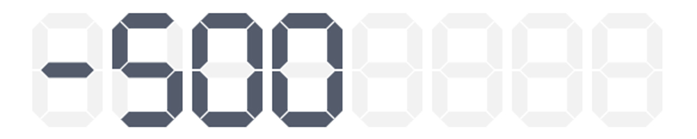
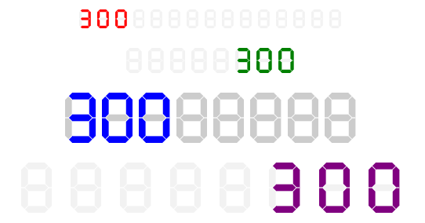

# SevenSegmentDisplay

A React component that renders a seven-segment display to visually represent numerical values.

## Installation

| left-aligned (default)                             | right-aligned                                  |
|----------------------------------------------------|------------------------------------------------|
|  |  |



Install the package using npm:

```sh
npm install react-ts-seven-segment-display
```

or using yarn:

```sh
yarn add react-ts-seven-segment-display
```

## Usage

```jsx
import SevenSegmentDisplay from "react-ts-seven-segment-display";

function App() {
  return (
    <div>
      <h1>Seven Segment Display</h1>
      <SevenSegmentDisplay value={123} height={100} segmentSize={6} />
    </div>
  );
}

export default App;
```

## Props

| Prop          | Type      | Default  | Description |
|--------------|----------|----------|-------------|
| `value`      | number   | `null`   | The numerical value to be displayed. Supports negative numbers. |
| `height`     | number   | `64`     | The height of each segment display. |
| `segmentSize`| number   | `8`      | Number of segments to allocate for the display. |
| `bgColor`    | string   | `#F2F2F2`| Background color of inactive segments. |
| `color`      | string   | `#545C6C`| Color of active segments. |
| `spacing`    | number   | `8`      | Space between individual digits. |
| `startFromEnd` | boolean | `false`  | Determines whether the number is right-aligned in the display. |
| `autoGrow`   | boolean  | `false`  | If `true`, the component adjusts segment size based on the number's length. |

## Features
- Supports numbers and negative values.
- Customizable height, spacing, and colors.
- Align digits dynamically using `startFromEnd`.
- Automatically adjust segment size with `autoGrow`.

## Repository

[GitHub Repository](https://github.com/begenchmyrat/react-ts-seven-segment-display)

## License

This project is licensed under the ISC License.

