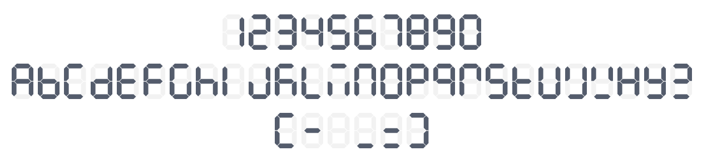

# React Seven-Segment Display Component

A customizable seven-segment display component for React and TypeScript. Perfect for displaying numeric and alphanumeric values in a digital clock, scoreboard, or retro-style interface.


| left-aligned (default)                             | right-aligned                                  |
|----------------------------------------------------|------------------------------------------------|
|  |  |




## Installation

You can install this package using npm or yarn:

```sh
npm install react-ts-seven-segment-display
```

or

```sh
yarn add react-ts-seven-segment-display
```

## Usage

Import the component and use it in your React project:

```tsx
import React from "react";
import SevenSegmentDisplay from "react-ts-seven-segment-display";

const App = () => {
  return (
    <div>
      <SevenSegmentDisplay value={1234} height={80} color="red" autoGrow />
    </div>
  );
};

export default App;
```

## Props

| Prop         | Type               | Default   | Description |
|-------------|--------------------|-----------|-------------|
| `value`     | `number \| string \| null` | `null` | The value to display. |
| `height`    | `number`           | `64`      | Height of the segment display. |
| `segmentSize` | `number`         | `8`       | Number of segments to display. |
| `bgColor`   | `string`           | `"#F2F2F2"` | Background color of inactive segments. |
| `color`     | `string`           | `"#545C6C"` | Color of active segments. |
| `spacing`   | `number`           | `8`       | Spacing between segments. |
| `startFromEnd` | `boolean`       | `false`   | Align numbers to the end of the display. |
| `autoGrow`  | `boolean`          | `false`   | Automatically adjust segment size based on input length. |

## Supported Characters

The following characters are supported for display:

```
0 1 2 3 4 5 6 7 8 9 A B C D E F G H I J K L M N O P Q R S T U V W X Y Z - _ = [ ]
```

## License

This project is licensed under the ISC License.

## Author

Created by [begenchmyratmeredamanov](mailto:begenchmyratmeredamanov@gmail.com).

## Repository

[GitHub Repository](https://github.com/begenchmyrat/react-ts-seven-segment-display)

